<div align="center">

# 面向私有业务文档的本地知识 Agent

通用工具型 Agent runtime，内置 evidence-first RAG 检索子系统。

<p>
  
  
  
  
  
</p>

<p>
  
  
  
</p>

<p>
  <a href="#快速开始">快速开始</a> ·
  <a href="#架构总览">架构</a> ·
  <a href="#agent-编排层">Agent 设计</a> ·
  <a href="#测试命令">测试</a> ·
  <a href="#目录地图">目录地图</a> ·
  <a href="#参考文档">参考文档</a>
</p>

</div>

这个项目的核心是一个单入口的通用 Agent runtime。它通过 while-loop 驱动模型自主选择工具、执行任务、回灌结果，直到产出最终答案。RAG 是 Agent 可调用的证据检索子系统，负责把私有资料定位成可复查证据；此外 Agent 还能直接处理本地文件、表格分析、代码执行、子任务隔离、审批和 checkpoint。

当前架构的核心不是“多个角色 Agent 互相编排”，而是：

```text
用户任务 -> generic AgentLoop -> 模型选择工具 -> 工具执行 -> 结果回模型上下文 -> 最终答案
```

RAG 是 Agent 可以调用的一类工具，不是所有任务的默认入口。对本地 Excel、CSV、JSON 等文件分析，优先走 workspace 文件工具和 Python 分析；只有需要知识库证据时才走 RAG 检索。

`agent run` 默认是纯 Agent 入口，不会因为本地存在 `.rag` 或配置了 embedding/reranker 就启动 RAG。需要知识库证据时显式传入 `--knowledge`，RAG 才会作为 lazy knowledge provider 注册，并在模型首次调用 `search_knowledge` 时初始化。

Python SDK 的推荐入口是 `agent_runtime.Agent`。`rag` 仍保留为兼容层和底层 RAG 子系统，因为检索、入库、存储和模型装配代码还在这个包内。对用户暴露的项目名和主命令已经收敛为 `agent-runtime` / `agent`：

```text
agent run / chat / resume    # Agent 主入口
agent model list/current/switch # 当前模型会话控制
rag ingest / query / delete  # 知识库维护和底层诊断入口
```

## 快速开始

```bash
cd "/Users/leixiaoying/LLM/RAG学习"
uv sync
```

云模型可以不用配。默认走本地 LLM；`agent run --model qwen3_8b_mlx_4bit`
会按 `configs/models.yaml` 的 `runtime` 配置检查 `127.0.0.1:8080/v1/models`，
未启动时自动拉起本地 OpenAI-compatible server，然后再调用模型。

直接调用 Agent：

```bash
uv run agent run \
  "总结一下这个项目现在的能力边界" \
  --verbose
```

`agent run` 不会根据任务文本自动暴露工具 schema。需要工具时，由入口显式传入本轮工具面：

```bash
uv run agent run \
  "找到 AgentService 的定义文件" \
  --tool search_text \
  --tool list_files \
  --tool read_file

uv run agent run \
  "运行 echo hello" \
  --tool run_command \
  --allow-execute-tools
```

分析本地文件：

```bash
uv run agent run \
  "读取这个文件，列出结构并给出摘要" \
  --file "/absolute/path/to/file.xlsx" \
  --verbose
```

Python SDK：

```python
from agent_runtime import Agent

agent = Agent(model="qwen3_8b_mlx_4bit")
agent.switch_model("mimo_cloud")  # 切换当前 SDK session，不修改 configs/models.yaml
result = agent.run("总结一下这个项目")
print(result.answer)

with_tools = agent.run(
    "找到 AgentService 的定义文件",
    tools=["search_text", "list_files", "read_file"],
)
print(with_tools.answer)
```

只有维护知识库或做底层检索诊断时，才需要启动 embedding 服务并使用 `rag ingest/query`。日常问答仍然只调用 `agent`：

```bash
screen -S rag_embedding_9090 -X quit >/dev/null 2>&1 || true
screen -dmS rag_embedding_9090 zsh -lc '
cd "/Users/leixiaoying/LLM/RAG学习"
uv run rag embedding-service \
  --model mlx-community/Qwen3-Embedding-4B-4bit-DWQ \
  --port 9090 \
  --batch-size 1
'

export RAG_EMBEDDING_SERVICE_URL="http://127.0.0.1:9090"
export STORAGE_ROOT="data/quickstart"
export VECTOR_DSN="http://127.0.0.1:19530"
export VECTOR_PREFIX="quickstart_v1"
```

最小知识库 Agent smoke：

```bash
uv run rag ingest \
  --storage-root "$STORAGE_ROOT" \
  --vector-backend milvus \
  --vector-dsn "$VECTOR_DSN" \
  --vector-collection-prefix "$VECTOR_PREFIX" \
  --source-type plain_text \
  --location memory://quickstart/support-sla \
  --title "示例客服 SLA" \
  --owner quickstart \
  --content "示例客服 SLA：P1 工单首次响应目标为 30 分钟，解决目标为 4 小时。"

uv run agent run \
  "P1 工单首次响应目标是多少？请给出处" \
  --knowledge quickstart \
  --verbose
```

## Agent 工具面与 ACI

默认编码工具面只有六个常驻工具，顺序稳定：`list_files`、`search_text`、`read_file`、`apply_patch`、`run_command`、`update_plan`。本地 workspace 导航遵循 Grep-not-RAG 规则：先用 `list_files` 或 `search_text` 定位当前文件，再用 `read_file` 读取；不会为了搜索源码或已导入文件自动启动 RAG。

工具面选项的优先级是确定的：

1. 非空 `--tool` / SDK `tools=` 是精确的初始工具面，会取代默认常驻面；未传或传空列表则使用默认面。
2. `--disable-tool` / `disabled_tools=` 最后过滤工具，无论它来自默认、显式请求还是激活结果，都不会被重新加回。
3. `--allow-discovery-tools` 只在已安装 hidden tools 时向默认面加入 `find_tools`；它不会自动扩展非空的显式工具面。显式请求 `find_tools` 时也必须同时开启该标志。

`--knowledge <name>` 是知识库的显式开关：它注册 `search_knowledge`，并在使用默认工具面时将其放入该 run 的可见面；非空 `--tool` 仍按上述优先级取代默认面。实际 RAG 资源在首次调用时延迟初始化。没有 `--knowledge` 时不安装 `search_knowledge`，也不会因任务文本或环境变量暗中启用。

`apply_patch` 和 `run_command` 的 schema 可见不等于已授权。默认写 workspace 和执行进程会暂停并要求审批；`--allow-write-tools` 和 `--allow-execute-tools` 分别预授权这两类 effect。网络和破坏性 effect 仍会要求审批。要跨进程恢复，运行时传 `--checkpoint-db` 和稳定的 `--run-id`，然后使用 `agent resume ... --decision allow_once|deny|continue|abort`。

恢复时会重建工具 manifest。如果漂移没有影响 pending/paused call，运行时创建新 revision，并移除已不存在的 active tool；如果已有 call 依赖变更或缺失的工具，则 fail closed 为 `tool_reconciliation` 暂停。每个 call 始终保留创建它的 `request_id`、`toolset_revision` 和 `exposed_tool_names`，不会被恢复后的当前 turn 覆盖。

模型用量中，`cache_read_input_tokens` / `cache_write_input_tokens` 只记录 provider 明确返回的 cache 计数；`usage_source=provider` 表示账本来自 provider，`usage_source=tokenizer_estimate` 表示本地估算，后者不会伪造 cache hit。

离线 ACI 评估覆盖 direct answer、导航、Grep、读取、补丁、命令、知识库、hidden MCP、子任务、hidden-tool hallucination、相似工具混淆和中文发现。它报告 surface recall/precision、tool choice、参数有效性、多余调用、discovery recall@5、恢复率、schema bytes/tokens 和 cache 来源，不在没有真实模型 baseline 时设置质量阈值：

```bash
uv run python scripts/agent_tool_aci_eval.py --fake-model --json
uv run python scripts/agent_delivery_smoke.py --fake-model --verbose

# 真实 provider 检查是显式 opt-in，不进入离线 CI
uv run python scripts/agent_delivery_smoke.py --model <model-alias> --verbose
```

## News

- 2026-07-13：Agent 工具运行时收敛为单一 `Tool` 合同、单一注册表、单一可见性函数和单一执行入口；新增 deterministic fake-model ACI 评估。
- 2026-07-07：`agent run` 和 `agent_runtime.Agent` 支持显式工具面配置；默认不再因为任务文本关键词暴露工具 schema，工具 schema 由入口结构化配置传入主路径。
- 2026-07-02：新增 `agent_runtime.Agent` Python SDK facade；`agent run` 改为通过 facade 调用内部 `AgentService`；RAG 从默认自动挂载改为显式 `--knowledge`，并以 lazy knowledge provider 形式在首次工具调用时初始化。
- 2026-06-30：Agent CLI 产品化清理：`agent run/chat/resume` 默认只展示 Agent 参数；当时的 RAG runtime 自动附加行为已在 2026-07-02 改为显式 `--knowledge`。
- 2026-06-30：项目入口产品化：项目名改为 `agent-runtime`，新增顶层 `agent` 命令；`rag` CLI 只保留 ingest/query/delete/benchmark/service 等 RAG 子系统命令；删除旧 `analyze-task` 和 `RAGRuntime.analyze_task()` 残口。
- 2026-06-14：PR0 升级 prompt/tool 协议：section 化 system prompt、内部 `ModelMessage`、OpenAI-compatible `tools=`、工具结果消息回灌。
- 2026-06-12：单 Agent 内核迁移到 Claude-like while loop。LangGraph 保留为外层复杂 workflow，不再表达普通 `model -> tool -> result` 循环。
- 2026-05：RAG 侧完成多格式入库、summary index、Milvus/PostgreSQL、asset grounding、DuckDB 表格计算和私有检索评测基线。

## 能力一览

| 能力 | 当前状态 | 关键实现 |
| --- | --- | --- |
| Agent 内核 | 单 generic loop，模型选择工具，运行时负责安全边界 | `rag/agent/loop/runtime.py` |
| 工具选择/发现 | 六个编码工具常驻，hidden tools 由 `find_tools` 搜索并原子激活 | `rag/agent/tools/selection.py` |
| 本地文件工具 | workspace 导入、列文件、Grep、有界读取、精确补丁和命令 | `rag/agent/tools/builtins/` |
| 外部工具接入 | knowledge、MCP、skills 和 subagent 适配为相同 `Tool` 值 | `rag/agent/tools/integrations/` |
| 多格式入库 | 支持 PDF、Word、Markdown、Excel、PPT、图片、纯文本 | `rag/ingest/pipeline.py`、`rag/ingest/parsers/*` |
| 多粒度索引 | doc / section / asset 三类 summary index | `SummaryRecord`、Milvus collections |
| 混合检索 | 支持 `fast / auto / deep / asset / bypass` profile | `rag/retrieval/l3_l4_engine.py`、`rag/retrieval/orchestrator.py` |
| Grounding | 原文回读、anchor replacement、neighbor expansion | `rag/retrieval/grounding_service.py` |
| 表格计算 | Excel asset 转 parquet，DuckDB 受限只读查询 | `rag/ingest/table_sampler.py`、`rag/ingest/table_executor.py` |
| 评测 | 公开 MedicalRetrieval mini + 私有 golden queries | `scripts/evaluate_private_retrieval.py` |

## 系统流程

```mermaid
%%{init: {"theme": "base", "themeVariables": {"fontSize": "11px", "primaryColor": "#f8fafc", "primaryTextColor": "#0f172a", "primaryBorderColor": "#cbd5e1", "lineColor": "#94a3b8", "clusterBkg": "#ffffff", "clusterBorder": "#e2e8f0"}, "flowchart": {"nodeSpacing": 18, "rankSpacing": 22, "curve": "basis", "padding": 4}} }%%
flowchart TB
    subgraph RAG["RAG evidence pipeline"]
        direction LR
        r1["文件"] --> r2["解析"] --> r3["section / asset"] --> r4["summary"] --> r5["embedding"] --> r6["检索"] --> r7["grounding"] --> r8["引用回答"]
    end

    subgraph AG["Generic Agent runtime"]
        direction LR
        a1["用户任务"] --> a2["结构化工具选项"] --> a3["可见 Tool 序列"] --> a4["模型 turn"] --> a5["ToolExecutor"] --> a6["ToolResult 回上下文"] --> a7["最终答案"]
        a3 --> a8["find_tools / 原子激活"]
        a5 --> a9["workspace / knowledge / MCP / subagent"]
    end

    classDef rag fill:#eef6ff,stroke:#7aa7d9,color:#0f172a;
    classDef agent fill:#f4f0ff,stroke:#a78bfa,color:#0f172a;
    class r1,r2,r3,r4,r5,r6,r7,r8 rag;
    class a1,a2,a3,a4,a5,a6,a7,a8,a9 agent;
```



Agent 负责在工具之间做有界循环；RAG 负责可引用证据和检索质量。两者共享工具契约、预算、权限、失败显式化和证据保真规则。

## 架构总览

这个项目的主要业务场景是私有资料问答和文件分析：制度/流程文档回答审批规则、费用报销、销售政策；销售日报 Excel 回答提货量、区域汇总、产品口径；PPT/Word/PDF 回答跨文档事实并给出处。系统分成两层：generic Agent runtime（任务驱动层）和 RAG evidence pipeline（证据检索层）。

```text
Agent Runtime：任务执行
  generic AgentLoop、ToolRegistry、select_tools、ToolExecutor、Workspace、Memory、Checkpoint

L1 Storage：事实层
  原始文件、Document、SectionRecord、AssetRecord、locator、权限、版本、处理状态

L2 Indexing：索引层
  文档摘要、正文 section 摘要、Excel/PPT/图片资产摘要 -> Embedding -> Milvus

L3 Planning：查询规划
  选择 fast / auto / deep / asset / bypass，生成 retrieval signals

L4 Retrieval：候选召回
  多粒度 summary 检索、候选清洗、融合、可选 rerank、召回诊断

L5 Grounding：证据回读
  回读原文、邻近 section、asset anchor、表格对象和计算结果

L6 Synthesis：回答合成
  基于 EvidenceItem 生成回答、引用、权限/合规复核
```

### L1：事实层

L1 保存事实数据和可追溯定位信息。制度条款、报销审批规则、销售政策正文落在 `Document / SectionRecord`；Excel sheet、PPT 表格、图片 OCR 区域等非正文内容落在 `AssetRecord`：

- `Document`：文档版本、权限、状态、来源。
- `SectionRecord`：正文窗口，带 `raw_locator`、byte range、token 窗口元数据。
- `AssetRecord`：表格、图片、OCR 区域、PPT 表格等非正文资产。
- Object Store：保存原始文件、visible text、表格对象、schema/sample 和 DuckDB 可读存储指针。

### L2：索引层

L2 保存检索入口。Milvus 中按粒度拆成三类 summary index，分别解决“先找哪份制度”“定位哪一节原文”“定位哪张表/哪页 PPT/哪个图片区域”的问题：

- `doc_summary`：文档级主题召回。
- `section_summary`：正文 section 召回。
- `asset_summary`：表格、图片、OCR、PPT 资产召回。

索引层保存 summary、向量、标量过滤字段和主键映射。原文、表格和权限信息仍由事实层提供。

### L3/L4：规划与检索

L3 判断查询应该如何检索，L4 负责候选召回和排序。系统支持这些 `retrieval_profile`：

- `bypass`
- `fast`
- `auto`
- `deep`
- `asset`

普通制度问答通常走 `auto`；销售日报、Excel 数字、PPT 表格和图片 OCR 问题优先走 `asset`；跨多个制度或需要多跳证据时使用 `deep`。

### L5：精读与证据层

L5 将 summary 命中的候选重新映射回原始正文或资产对象，确保最终答案不是只基于摘要猜测：

- 命中正文 section 后，通过 `visible_text_key + byte_range` 回读原文。
- 命中含表格锚点的 section 后，通过 `[ASSET_ANCHOR:...]` 找到绑定资产。
- 表格资产通过 DuckDB sandbox 执行受限只读查询。
- grounding 阶段受 token、目标数、并发和超时预算控制。

### L6：回答合成层

L6 只基于 `EvidenceItem` 合成回答。回答保留 `doc_id / section_id / asset_id`、citation anchor、检索分数、rerank 分数和 evidence metadata，便于复查“这个审批结论来自哪份制度哪一节”或“这个汇总数字来自哪个 Excel sheet”。

## 核心设计

### Agent 层：Tool-Centric While-Loop

Agent 只有一个 `generic` 入口，不区分角色身份。模型在同一个 while-loop 中产生工具调用或最终答案，运行时保持以下单一边界：

- `Tool` 是唯一生产工具合同，包含 schema、validator、runner、输出归一化、effects 和超时/取消语义。
- `ToolRegistry` 只做确定性装配，运行前 freeze 成不可变 snapshot。
- `select_tools()` 是唯一模型可见性函数，`find_tools` 只搜索 hidden tool 的冻结元数据。
- `can_use_tool()` 将调用判定为 allow / ask / deny，`ToolExecutor` 是唯一 validation-to-`ToolResult` 执行入口。
- provider 只适配 wire 格式，不选择、授权或执行工具。

### RAG 层：Summary-First, Grounding-Later

先用高密度 summary 做轻量召回，再回原文和资产对象精读。summary 负责定位，最终事实来自 grounding 后的 evidence。

### RAG 层：Facts in Storage, Search in Index

PostgreSQL / Object Store 保存事实；Milvus 保存向量索引和检索入口。原文、表格、定位、权限、版本归事实层，向量、BM25、标量过滤归索引层。

### Token-First

切分、窗口、摘要输入输出、grounding budget 和 Agent context budget 都按 token 控制：

- SectionRefiner 按 token 滑动窗口。
- 摘要输入输出按 token 裁剪。
- L5 grounding 和 Agent `BudgetLedger` 都按 token 记账。
- 大工具结果进入有界 observation、summary 或外部引用，不直接塞进长期状态。

### Asset-Aware Retrieval

表格、图片、OCR、PPT 表格都作为 `AssetRecord` 独立保存。正文中保留 `[ASSET_ANCHOR:...]`，精读阶段再解析锚点并回填对应资产 evidence。

### DuckDB Table Sandbox

表格资产以 `schema / sample_rows / row_count / column_count / storage_key` 进入上下文。涉及过滤、排序、聚合、排名、交叉对比的问题，由模型生成受限只读查询，交给 DuckDB sandbox 执行，再将计算结果交给合成层。

### Evidence Over Memory

Agent memory 用于 working memory compaction / injection，帮助控制上下文窗口。回答事实优先级为 RAG evidence 高于 memory；当两者冲突时，以 evidence 为准。

## Agent 编排层

Agent 层采用 tool-centric + Python while-loop kernel 设计。LangGraph 保留为外层复杂编排器，不再承担单 Agent 的逐轮控制。

运行链路如下：

```text
AgentRunRequest
  -> resolve_tool_options() / select_tools()
  -> stable ModelRequest + provider wire adapter
  -> AgentLoop
     -> model tool call
     -> ToolExecutor: guard -> permission -> approval -> run -> ToolResult
     -> activation + ToolResult 同一次状态转移
     -> checkpoint -> next turn / finish / pause
  -> AgentRunResult
```

工具面分为四类：

| 类型 | 默认可见 | 说明 |
| --- | --- | --- |
| 基础常驻 | 是 | `list_files`、`search_text`、`read_file`、`apply_patch`、`run_command`、`update_plan` |
| 显式配置 | 按配置 | 例如 `--knowledge` 安装的 `search_knowledge` |
| Hidden integrations | 否 | MCP、skills、subagent 等只能在允许 discovery 时由 `find_tools` 发现 |
| 显式 `--tool` | 是 | 非空列表替换默认面，`--disable-tool` 仍有最终否决权 |

本地文件任务优先走 workspace：

```text
--file / files=
  -> workspace/input_files/
  -> list_files / search_text
  -> read_file
  -> apply_patch or run_command when explicitly needed
```

需要知识库证据时显式配置 `--knowledge`，然后由模型调用 `search_knowledge`。已装配的 hidden integration 由 `find_tools` 返回最多五个候选，激活和工具结果作为一次原子 loop transition 持久化。

已实现 native OpenAI-compatible 工具调用、MLX/Ollama local envelope、输入/输出 schema 校验、审批、进程组超时与取消、结构化错误、tool-call origin、transcript checkpoint、manifest drift reconciliation 和 provider cache usage 传播。

## 当前能力

### 文档入库

支持这些文件类型：

- `.pdf`
- `.docx`
- `.md / .markdown`
- `.xlsx / .xls`
- `.pptx`
- `.png / .jpg / .jpeg / .webp`
- `.txt`

解析路径：

- Word / PDF / Markdown：Docling 结构树和标题分段。
- Excel：Pandas / OpenPyXL 读取 sheet，表格作为 asset。
- PPTX：`python-pptx` 解析 slide 文本、表格、备注。
- 图片：OCR 模块抽取 visible text 和 OCR region。

### 检索与回答

- 三类 summary index：doc / section / asset。
- 支持 retrieval profile：`bypass / fast / auto / deep / asset`。
- 支持 rerank、candidate cleanup、neighbor expansion。
- grounding 回读原文 byte range 和 asset anchor。
- 表格查询走 DuckDB sandbox。
- 最终回答基于 `EvidenceItem`，保留 citation 和 metadata。

### 评测

- 公开 benchmark：MedicalRetrieval mini。
- 私有制度数据：329 条 golden queries。
- 支持按题型拆分指标，观察 doc hit、section hit、MRR、rerank 消融和 top-k 扩展效果。

历史基线数据（MedicalRetrieval mini、私有制度评测），参见 [历史评测](docs/EVALUATION.md)。

## 当前默认运行配置

模型目录统一在 `configs/models.yaml` 中维护，业务代码不直接写 provider、模型名、base URL 或 API key。当前会话选择由 Model Control Plane 持有，不通过改 YAML 表示。CLI 可用：

```bash
uv run agent model list
uv run agent model current
uv run agent model switch mimo_cloud
```

`agent model switch` 写入 workspace-local session state；`agent run --model ...` 只是本次运行覆盖，不改变全局模型目录。指定什么模型就用什么模型：云端模型缺 API key 会报 `Missing API key: ...`；本地端口已被其他模型占用会报 endpoint conflict，不会 silent fallback。

当前默认：

- `defaults.primary_model`：`qwen3_8b_mlx_4bit`
- `qwen3_8b_mlx_4bit.model`：`mlx-community/Qwen3-8B-4bit`，OpenAI-compatible，`127.0.0.1:8080`，按 `runtime.launch_command` 自动启动
- Embedding：`mlx-community/Qwen3-Embedding-4B-4bit-DWQ`
- Rerank：`BAAI/bge-reranker-v2-m3`

真实端到端推荐链路：

```text
PostgreSQL metadata
  + local object store / parquet table assets
  + Milvus vector indexes
  + Redis cache
  + Mimo or OpenAI-compatible chat
  + MLX embedding
  + optional BGE rerank
```

表格 / 资产分析规则：

- Excel 入库后表格资产会记录 `row_count / column_count / schema / sample_rows / storage_key`。
- 表格资产会转换为 DuckDB 可读的 `.parquet` 对象。
- 涉及真实数据值、筛选、求和、计数、排序、排名、对比或聚合的问题，必须执行受限计算。
- `sample_rows` 只用于识别 schema，不允许被当成完整表格直接回答。
- 不允许通过“总计/合计/小计”等业务关键词硬编码来修某一张表；如果问题缺少产品、sheet、日期或统计口径，应暴露歧义或要求澄清。

历史端到端验证结果（制度问答、表格计算），参见 [历史评测](docs/EVALUATION.md#已验证端到端结果)。

安装和端口配置，参见 [运行手册](docs/RUNBOOK.md)。

服务启动、模型配置和健康检查命令，参见 [运行手册 - 模型服务管理](docs/RUNBOOK.md#模型服务管理)。

详细的入库、查询、Agent 测试、批量评测和 smoke 命令，参见 [运行手册](docs/RUNBOOK.md)。

使用真实 PostgreSQL + Milvus 链路的 Python API 示例，参见 [运行手册 - 真实 Postgres + Milvus 端到端](docs/RUNBOOK.md#真实-postgres--milvus-端到端)。

## 测试命令

完整测试：

```bash
uv run pytest -q
```

静态检查：

```bash
uv run ruff check
uv run mypy
uv run lint-imports
```

Agent runtime / tool discovery / task tool：

```bash
uv run pytest -q \
  tests/agent/test_builtin_agents.py \
  tests/test_tool_discovery.py \
  tests/agent/test_task_tool.py \
  tests/agent/test_loop_model_context.py \
  tests/agent/test_agent_loop_runtime.py
```

表格计算、grounding、Postgres metadata：

```bash
uv run pytest -q \
  tests/core/test_table_compute_integration.py \
  tests/service/test_grounding_service.py \
  tests/repo/test_postgres_metadata_repo.py
```

复杂 RAG / Agent 回归：

```bash
uv run pytest -q \
  tests/agent/test_complex_agent_rag_loop.py \
  tests/service/test_complex_rag_retrieval.py
```

## 目录地图

下面按文件解释主要代码。这里列的是源码里应该维护的文件，不包含 `__pycache__`、本地 `data/` 产物和一次性诊断输出。

```text
./
├── README.md                          # 项目说明、架构、Agent 设计
├── CLAUDE.md                          # AI coding agent 参考（启动命令、约束）
├── pyproject.toml                     # agent-runtime 项目元数据、console scripts、pytest/ruff/mypy 配置
├── uv.lock                            # uv 锁文件
├── configs/models.yaml                # 默认 chat / embedding / rerank 模型配置
├── docs/
│   ├── RUNBOOK.md                     # 安装、服务管理、端到端运行手册
│   ├── EVALUATION.md                  # 历史基线和已验证端到端结果
│   ├── TROUBLESHOOTING.md             # 常见问题和处理顺序
│   ├── agent_naming.md                # Agent 命名和迁移约定
│   ├── superpowers/specs/             # 已批准或历史设计规格
│   └── superpowers/plans/             # 分阶段实现计划
└── scripts/                           # 入库、评测、诊断、benchmark 脚本
    ├── agent_delivery_smoke.py        # CLI/SDK fake/live delivery matrix
    └── agent_tool_aci_eval.py         # deterministic Single Tool Runtime ACI 评估
```

```text
rag/
├── cli.py                             # RAG CLI：ingest / query / delete / benchmark / service
├── runtime.py                         # RAGRuntime 装配 storage、ingest、retrieval、synthesis
├── query_pipeline.py                  # 查询端 L3-L6 编排、表格 compute_request 循环
├── embedding_service.py               # 本地 embedding HTTP 服务入口
├── rerank_service.py                  # 本地 rerank HTTP 服务入口
├── agent/
│   ├── builtin/generic.py             # 当前唯一内置 Agent 定义
│   ├── core/
│   │   ├── model_request.py           # canonical request、toolset revision 和 cache-stable payload
│   │   ├── messages.py                # transcript 和 tool-result message
│   │   ├── llm_providers.py           # canonical request 到 provider adapter 的调用边界
│   │   ├── turn_contracts.py          # tool manifest 和 resume drift decision
│   │   └── checkpointing.py           # canonical checkpoint codec 和 saver adapter
│   ├── loop/
│   │   ├── runtime.py                 # Claude-like while-loop kernel
│   │   ├── state.py                   # bounded loop state 和 transitions
│   │   └── stop_hooks.py              # stop hook 协议和 bounded runner
│   ├── memory/                        # working memory compaction / injection / store
│   ├── skills/                        # Skill manifest、loader、catalog、invocation runtime
│   ├── service.py                     # AgentRunRequest / AgentRunResult / AgentService
│   ├── tools/
│   │   ├── tool.py                    # 唯一 Tool / ToolCall / ToolResult 合同
│   │   ├── registry.py                # 唯一 ToolRegistry
│   │   ├── selection.py               # resolve options / select_tools / find_tools
│   │   ├── permissions.py             # hard guards 和 can_use_tool
│   │   ├── executor.py                # 唯一 ToolExecutor
│   │   ├── builtins/                  # 六个常驻编码工具
│   │   └── integrations/              # knowledge / MCP / skills / subagent adapters
│   └── workspace.py                   # per-run workspace runtime
├── assembly/                          # provider 组装、能力检测、token accounting
├── ingest/                            # parser、section、summary、asset、table executor
├── models/                            # models.yaml schema、catalog、runtime 解析
├── providers/                         # generation、embedding、rerank、LLM gateway
├── retrieval/                         # L3-L6 检索、grounding、fusion、synthesis
├── schema/                            # Document / Section / Asset / Query / Runtime schema
├── storage/                           # metadata、object store、cache、vector backend
└── utils/                             # guard、telemetry、text helper
```

```text
tests/
├── agent/                             # Agent loop、tools、memory、checkpoint、CLI、service
├── core/                              # ingest、runtime、model config、table compute、Milvus
├── provider/                          # embedding / rerank / LLM gateway
├── repo/                              # object store、Postgres metadata、HF providers
├── service/                           # retrieval、grounding、synthesis、authorization
├── ui/                                # CLI behavior
└── test_tool_discovery.py             # capability catalog 和 deferred tools
```

## 参考文档

- **[运行手册](docs/RUNBOOK.md)**：安装、服务管理、端到端运行命令、注意事项
- **[历史评测](docs/EVALUATION.md)**：历史基线结果、已验证端到端结果
- **[故障排查](docs/TROUBLESHOOTING.md)**：常见问题和处理顺序
