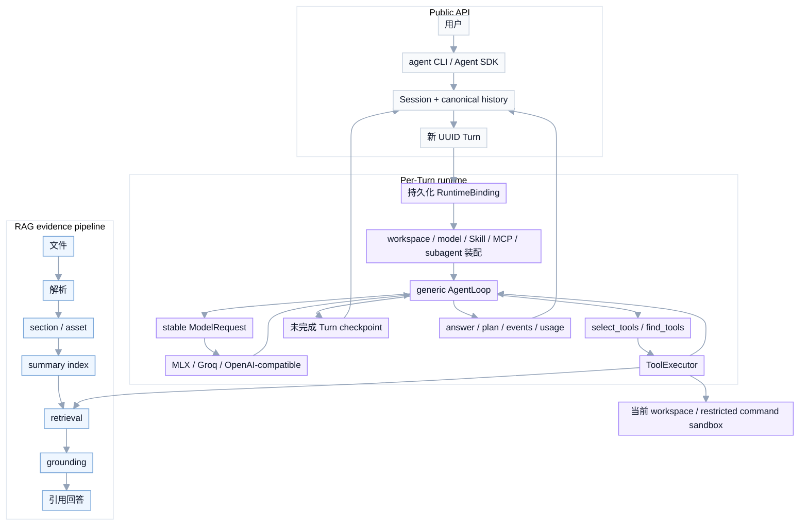

<div align="center">

# 面向私有业务文档的本地知识 Agent

通用工具型 Agent runtime，内置 evidence-first RAG 检索子系统。

<p>
  
  
  
  
  
</p>

<p>
  
  
  
  
</p>

<p>
  <a href="#快速开始">快速开始</a> ·
  <a href="#架构总览">架构</a> ·
  <a href="#agent-编排层">Agent 设计</a> ·
  <a href="#开发与质量验证">开发</a> ·
  <a href="#目录地图">目录地图</a> ·
  <a href="#参考文档">参考文档</a>
</p>

</div>

这是一个面向本地文件、代码任务与私有知识库的通用 Agent runtime。它通过 while-loop 驱动模型自主选择工具、执行任务并回灌结果，直到产出最终答案。对话围绕 Session 组织：一个 Session 保存一整段可跨进程继续的对话，每条新消息创建一个 Turn；Checkpoint 只恢复尚未完成的 Turn。

RAG 是 Agent 可调用的证据检索子系统，负责把私有资料定位成可复查证据；此外 Agent 还能直接处理当前 workspace、表格分析、受限命令执行、计划更新、Skill、MCP、隔离子任务和人工审批。

运行时采用单 Agent 内核，而不是让多个角色 Agent 互相转发消息：

```text
Session -> 新 Turn -> 装配 runtime -> generic AgentLoop
        -> 模型选择工具 -> ToolExecutor -> 结果回模型上下文 -> 完成或暂停
```

RAG 是 Agent 可以调用的一类工具，不是所有任务的默认入口。对本地 Excel、CSV、JSON 等文件分析，优先走 workspace 文件工具和 Python 分析；只有需要知识库证据时才走 RAG 检索。

`agent run` 默认是纯 Agent 入口，不会因为本地存在 `.rag` 或配置了 embedding/reranker 就启动 RAG。需要知识库证据时显式传入 `--knowledge`，RAG 才会作为 lazy knowledge provider 注册，并在模型首次调用 `search_knowledge` 时初始化。

Python SDK 的推荐入口是 `agent_runtime.Agent`。`rag` 提供底层 RAG 子系统与兼容入口，负责检索、入库、存储和模型装配。项目包名与主命令分别是 `agent-runtime` 和 `agent`：

```text
agent run                    # 单次任务：创建一个 Session 和一个 Turn
agent chat                   # 新建或继续 Session；每条消息创建新 Turn
agent resume <turn-id>       # 只恢复 paused / interrupted Turn
agent model list/current/switch # 当前模型会话控制
rag ingest / query / delete  # 知识库维护和底层诊断入口
```

## 快速开始

进入已克隆的仓库目录并安装依赖：

```bash
cd Private-RAG-Agent
uv sync
```

Agent 会读取仓库根目录的 `.env`，但不会覆盖已经存在的宿主环境变量。可以从示例配置开始：

```bash
cp .env.example .env
```

默认聊天模型是 Groq 上的 `groq_gpt_oss_120b`。在 `.env` 中配置密钥即可使用：

```dotenv
GROQ_API_KEY=your-key
```

也可以完全使用本地 Qwen3.5。`qwen3_5_9b_mlx_4bit` 会根据 `configs/models.yaml` 检查 `127.0.0.1:8080/v1/models`，服务未启动时自动拉起 MLX OpenAI-compatible server：

```bash
uv run agent run \
  "读取当前项目中的 pyproject.toml，并说明包入口" \
  --model qwen3_5_9b_mlx_4bit \
  --verbose
```

直接调用 Agent：

```bash
uv run agent run \
  "总结一下这个项目现在的能力边界" \
  --verbose
```

`agent run` 会根据当前 workspace 中已安装、已启用的能力自动装配工具面。只需描述任务，不需要记忆工具名；CLI 会展示实际调用的工具和结果。普通工具审批显示有界参数，`run_command` 审批完整显示命令、cwd、网络状态和执行模式：

```bash
uv run agent run \
  "找到 AgentService 的定义文件并说明主要职责" \
  --verbose

uv run agent run \
  "运行测试并修复失败项"
```

在交互式终端里，写入或执行类调用会先保存 pending checkpoint，然后在当前命令、同一 runtime 和同一 `ToolCall` 上询问审批并继续。`--non-interactive` 或非 TTY 环境不会等待输入：命令保存暂停状态、输出 `agent resume` 命令并以退出码 2 结束。

长对话使用 Session。省略 `--session-id` 会创建新 Session；重新启动进程后传回同一个 Session ID，即可从持久化 canonical history 继续聊天，并为新消息创建新的 Turn：

```bash
uv run agent chat --model qwen3_5_9b_mlx_4bit

# CLI 会输出 Session 和每个 Turn 的 UUID
uv run agent chat --session-id <session-id>
```

`resume` 不用于续聊，只用于恢复未完成的 Turn。可用动作由暂停类型决定；不匹配的动作会明确报错：

```bash
uv run agent resume <turn-id> --action allow_once
uv run agent resume <turn-id> --action deny
uv run agent resume <turn-id> --action continue
uv run agent resume <turn-id> --action mark_completed
uv run agent resume <turn-id> --action mark_failed
uv run agent resume <turn-id> --action abort
```

分析本地文件：

```bash
uv run agent run \
  "读取这个文件，列出结构并给出摘要" \
  --file "./path/to/file.xlsx" \
  --verbose
```

Python SDK：

```python
from pathlib import Path

from agent_runtime import Agent

agent = Agent(
    model="qwen3_5_9b_mlx_4bit",
    checkpoint_db=Path(".rag/agent_checkpoints.sqlite"),
    workspace_path=Path.cwd(),
)

first = agent.chat("记住项目代号 ORCHID-731")
second = agent.chat("项目代号是什么？", session_id=first.session_id)

print(second.session_id)
print(second.turn_id)
print(second.answer)

# 只有 paused / interrupted Turn 才能恢复
if second.status == "paused":
    second = agent.resume(second.turn_id, "allow_once")
```

`Agent.run()` / `arun()` 是 one-shot 便利入口；`chat()` / `achat()` 在 Session 下创建新 Turn；`resume()` / `aresume()` 恢复原 Turn。`AgentResult` 公开 `session_id`、`turn_id`、`plan` 和 `plan_events`；`run_id` 是 deprecated Turn ID 别名，`thread_id` 也与当前 Turn 对齐。SDK 不读取 stdin，遇到审批会返回 paused 状态或规范事件；提前停止消费 `stream()` 时，调用方应显式 `aclose()`。

构建发行包：

```bash
uv build --wheel
uv tool install --force dist/*.whl
```

wheel 内置 `configs/models.yaml` 的发行快照，因此安装后从任意 cwd 都能解析 `qwen3_5_9b_mlx_4bit`。`RAG_AGENT_MODELS_PATH` 和 `RAG_AGENT_MODELS` 仍可显式覆盖目录；运行时不会依赖源码仓库旁边恰好存在一份配置。

只有维护知识库或进行底层检索诊断时，才需要启动 embedding 服务并使用 `rag ingest/query`。日常文件与代码任务只需调用 `agent`。在仓库根目录启动 embedding 服务：

```bash
uv run rag embedding-service \
  --model mlx-community/Qwen3-Embedding-8B-4bit-DWQ \
  --port 9090 \
  --batch-size 1
```

在另一个终端中配置知识库连接：

```bash
export RAG_EMBEDDING_SERVICE_URL="http://127.0.0.1:9090"
export STORAGE_ROOT="data/quickstart"
export VECTOR_DSN="http://127.0.0.1:19530"
export VECTOR_PREFIX="quickstart_v1"
```

最小知识库示例：

```bash
uv run rag ingest \
  --storage-root "$STORAGE_ROOT" \
  --vector-backend milvus \
  --vector-dsn "$VECTOR_DSN" \
  --vector-collection-prefix "$VECTOR_PREFIX" \
  --source-type plain_text \
  --location memory://quickstart/support-sla \
  --title "示例客服 SLA" \
  --owner quickstart \
  --content "示例客服 SLA：P1 工单首次响应目标为 30 分钟，解决目标为 4 小时。"

uv run agent run \
  "P1 工单首次响应目标是多少？请给出处" \
  --knowledge quickstart \
  --verbose
```

## Agent 工具面与 ACI

默认编码工具面只有六个常驻工具，顺序稳定：`list_files`、`search_text`、`read_file`、`apply_patch`、`run_command`、`update_plan`。本地 workspace 导航遵循 Grep-not-RAG 规则：先用 `list_files` 或 `search_text` 定位当前文件，再用 `read_file` 读取；不会为了搜索源码或已导入文件自动启动 RAG。

产品装配规则是确定的：

1. 六个编码工具始终常驻。
2. 显式配置 knowledge 时，`search_knowledge` 常驻。
3. 启动时扫描 workspace 中的 Skill catalog；只有存在 policy 允许且模型可调用的 Skill 时，`invoke_skill` 和 `materialize_skill_asset` 才常驻。扫描 catalog 不等于创建工具，更不等于所有 Skill 已激活。
4. 只要冻结 Registry 中存在 hidden 且 discoverable 的工具，`find_tools` 就常驻。当前 MCP 和 subagent 使用这条路径，可见性规则不依赖 capability 的来源类型。

`tools=`、`disabled_tools=` 和 `allow_discovery_tools=` 仍作为 deprecated keyword-only 兼容入口被 SDK 接受，CLI 也保留对应隐藏选项；它们不是普通用户需要学习的主交互。

`--knowledge <name>` 是知识库的显式开关：它注册并常驻 `search_knowledge`，实际 RAG 资源在首次调用时延迟初始化。没有 `--knowledge` 时不安装该工具，也不会因任务文本或环境变量暗中启用。

MCP 从 workspace 的 `configs/mcp_servers.yaml` 装配，也可用 `AGENT_MCP_CONFIG` 覆盖路径。server 必须显式 `enabled` 且配置 `tools_allowlist` 或 `allow_all_tools`；默认示例全部禁用。单个 server 启动失败会产生 runtime diagnostic，不会移除其他已装配能力，而非法配置仍会明确失败。

Skill 资产访问有独立的 hard guard：`invoke_skill` 只能激活 catalog/policy 允许的 Skill，`materialize_skill_asset` 只能访问 checkpoint 中已激活 Skill 的 root；未激活、路径越界或状态不一致都会 hard-deny。

`apply_patch` 和 `run_command` 的 schema 可见不等于已授权。默认写 workspace 和执行进程需要审批；`--allow-write-tools` 和 `--allow-execute-tools` 分别预授权这两类 effect。审批互动只存在于 CLI 层，SDK、`can_use_tool()` 和 `ToolExecutor` 都不读 stdin。拒绝会生成标准 `tool_denied` 结果供模型调整，不会把命令直接弄崩。默认 checkpoint 位于 `.rag/agent_checkpoints.sqlite`；跨进程恢复时使用 CLI 输出的 `agent resume <turn-id> --action ...` 命令。

`run_command` 不以宿主用户的完整能力直接执行，而是进入 macOS Seatbelt 受限沙箱：

- cwd 必须位于当前 workspace；只允许写 workspace 和本次命令的私有临时目录。
- 不继承宿主环境，`HOME`、cache 和临时目录都重定向到私有目录；token、key、secret 和密码不会透传。
- 默认禁止网络，也不能访问用户 home、其他项目、SSH 配置或 Docker socket。
- `network=true` 只提出联网请求。执行审批和网络审批是两个独立 gate；`--allow-execute-tools` 不会顺带授权网络。
- 审批展示完整命令、解析后的 cwd、网络状态和 `restricted_sandbox` 执行模式，不截断成命令预览。
- 沙箱不可用时 fail closed，不会退回可信本机执行。超时或取消会终止并回收整个进程组。

所有工具仍通过同一个 `ToolExecutor`。有副作用的调用在持久化记录中明确区分 `prepared` 与 `started`；非幂等调用若在 `started` 后中断且结果不可确认，会进入 `outcome_unknown`，必须先用 `mark_completed` 或 `mark_failed` 对账，禁止直接重放。

`update_plan` 是同一工具面中的 advisory tool，不是第二套任务系统。它提交完整有序计划，运行时将其写入 canonical `PlanState` 和 checkpoint，并通过三条公开路径暴露：CLI 的计划摘要、stream 的 `plan_updated` 事件，以及 `AgentResult.plan / plan_events`。计划状态不授予任何工具权限。

恢复时会重建工具 manifest。如果漂移没有影响 pending/paused call，运行时创建新 revision，并移除已不存在的 active tool；如果已有 call 依赖变更或缺失的工具，则 fail closed 为 `tool_reconciliation` 暂停。每个 call 始终保留创建它的 `request_id`、`toolset_revision` 和 `exposed_tool_names`，不会被恢复后的当前 turn 覆盖。

模型用量中，`cache_read_input_tokens` / `cache_write_input_tokens` 只记录 provider 明确返回的 cache 计数；`usage_source=provider` 表示账本来自 provider，`usage_source=tokenizer_estimate` 表示本地估算，后者不会伪造 cache hit。

确定性 runtime 门禁和真实模型质量门禁彼此分离：

- fake/stub 测试负责工具装配、权限、checkpoint、恢复、stream 和结果结构等确定性行为。
- live gate 只评价模型相关的工具使用质量，不把 provider 配额、网络故障或 runtime 基础设施故障算成模型退化。

离线 ACI 评估覆盖 direct answer、导航、Grep、读取、补丁、命令、知识库、hidden MCP、子任务、hidden-tool hallucination、相似工具混淆和中文发现。它报告 surface recall/precision、tool choice、参数有效性、多余调用、discovery recall@5、恢复率、schema bytes/tokens 和 cache 来源：

```bash
uv run python scripts/agent_tool_aci_eval.py --fake-model --json
uv run python scripts/agent_delivery_smoke.py --fake-model --verbose
uv run python scripts/agent_cli_smoke.py
```

真实门禁覆盖 Qwen3.5 和 Groq 的文件工具选择、缺失文件恢复、审批后继续、重复失败控制、参数有效性和 ACI 调用效率。基线由真实重复试验自动校准，阈值取每项指标的 empirical worst-trial envelope，不手填宽容值：

```bash
# 校准固定覆盖两个声明模型；每个模型至少 3 次 trial
uv run python scripts/agent_model_quality_gate.py calibrate \
  --env-file .env \
  --trials 3

# 按已提交 baseline 运行全部模型
uv run python scripts/agent_model_quality_gate.py gate --env-file .env

# 也可单独运行一个声明模型
uv run python scripts/agent_model_quality_gate.py gate \
  --env-file .env \
  --model qwen3_5_9b_mlx_4bit

uv run python scripts/agent_model_quality_gate.py gate \
  --env-file .env \
  --model groq_gpt_oss_120b
```

已提交的基线包含 `3 trials × 5 cases × 2 models = 30` 条真实观察。成功率、工具选择、失败恢复、审批继续、重复失败控制和参数有效性下限均为 `1.0`；冗余失败重放上限为 `0.0`；每 case 平均工具调用和模型调用上限分别为 `2.0` 和 `3.0`。gate 退出码为：`0 = PASS`、`1 = QUALITY_FAIL`、`2 = INFRASTRUCTURE_INCONCLUSIVE / 配置错误`。原始观察和阈值保存在 `evals/model_quality/baseline_v1.json`，加载时会重新计算 trial 指标与阈值，篡改会 fail loud。

## 版本亮点

- **可恢复长对话**：Session 保存完整 canonical history，每条消息创建独立 Turn，Checkpoint 只恢复 paused / interrupted Turn。
- **统一 CLI 与 SDK**：`agent run/chat/resume` 和 `agent_runtime.Agent` 共用同一 runtime 装配、权限、stream 与结果语义。
- **安全命令执行**：`run_command` 默认进入受限沙箱，使用最小环境、默认断网，并将命令执行与联网审批分离。
- **本地与云端模型**：支持本地 MLX Qwen3.5 和 Groq；wheel 内置模型目录，可从任意工作目录解析模型 alias。
- **可观测 ACI**：单一 Tool 合同、可见性函数和执行入口，计划、工具事件、usage 与恢复状态通过 CLI、stream 和 result 暴露。
- **Evidence-first RAG**：多格式入库、summary index、Milvus/PostgreSQL、asset grounding 和 DuckDB 表格计算按需作为 Agent 工具启用。

## 能力一览

| 能力 | 说明 | 关键实现 |
| --- | --- | --- |
| 公开入口 | CLI-first，Python SDK 同步提供 run / chat / stream / resume | `rag/agent/cli.py`、`agent_runtime/agent.py` |
| 长对话 | Session 保存完整 canonical history；每条消息创建 UUID Turn | `rag/agent/sessions.py` |
| 未完成恢复 | Checkpoint 只恢复 paused / interrupted Turn；完成和失败状态 fail loud | `rag/agent/core/checkpointing.py`、`rag/agent/service.py` |
| Agent 内核 | 单 generic loop，模型选择工具，运行时负责安全边界 | `rag/agent/loop/runtime.py` |
| 模型请求 | provider-neutral `ModelRequest`；OpenAI wire 只产生一个前置 system message | `rag/agent/core/model_request.py`、`rag/providers/openai_wire.py` |
| 工具选择/发现 | 六个编码工具常驻，hidden tools 由 `find_tools` 搜索并原子激活 | `rag/agent/tools/selection.py` |
| 本地文件工具 | workspace 导入、列文件、Grep、有界读取、精确补丁和命令 | `rag/agent/tools/builtins/` |
| 命令安全 | Seatbelt 受限执行、空白宿主环境、默认断网、网络独立审批 | `rag/agent/tools/builtins/shell.py` |
| 副作用恢复 | prepared / started / outcome_unknown 记录；非幂等未知结果禁止重放 | `rag/agent/tools/executor.py` |
| 计划透明度 | `update_plan` 持久化到 checkpoint，并通过 CLI / stream / result 暴露 | `rag/agent/planning.py` |
| 外部工具接入 | knowledge、MCP、skills 和 subagent 适配为相同 `Tool` 值 | `rag/agent/tools/integrations/` |
| 模型质量 | fake/stub runtime 门禁与 Qwen3.5/Groq live quality gate 分离 | `scripts/agent_model_quality_gate.py` |
| 发行包 | wheel 内置模型目录，可从源码仓库外解析 Qwen3.5 alias | `pyproject.toml`、`rag/agent/core/llm_registry.py` |
| 多格式入库 | 支持 PDF、Word、Markdown、Excel、PPT、图片、纯文本 | `rag/ingest/pipeline.py`、`rag/ingest/parsers/*` |
| 多粒度索引 | doc / section / asset 三类 summary index | `SummaryRecord`、Milvus collections |
| 混合检索 | 支持 `fast / auto / deep / asset / bypass` profile | `rag/retrieval/l3_l4_engine.py`、`rag/retrieval/orchestrator.py` |
| Grounding | 原文回读、anchor replacement、neighbor expansion | `rag/retrieval/grounding_service.py` |
| 表格计算 | Excel asset 转 parquet，DuckDB 受限只读查询 | `rag/ingest/table_sampler.py`、`rag/ingest/table_executor.py` |
| 评测 | 公开 MedicalRetrieval mini + 私有 golden queries | `scripts/evaluate_private_retrieval.py` |

## 系统流程



Agent 负责 Session/Turn 生命周期和工具之间的有界循环；RAG 负责可引用证据和检索质量。两者共享工具契约、预算、权限、失败显式化和证据保真规则，但 RAG 不接管普通文件任务。

## 架构总览

主要使用场景包括代码与文件任务、私有资料问答和可恢复的长对话。系统由公开 API、generic Agent kernel、canonical ACI 和按需启用的 RAG evidence pipeline 组成。

```text
Public Product Layer
  agent CLI、agent_runtime.Agent、AgentResult、StreamEvent

Conversation State Layer
  Session、Turn、canonical history、secret-free RuntimeBinding、lease

Runtime Assembly Layer
  model、workspace、knowledge、MCP、Skill、subagent 的按 Turn 装配与回收

Agent Kernel
  AgentLoop、PlanState、working-memory compaction、StopHook、Checkpoint

Model Boundary
  StableModelContext -> ModelRequest -> provider wire -> ModelTurn

ACI / Execution
  Tool -> ToolRegistry -> select_tools/find_tools -> can_use_tool -> ToolExecutor

L1 Storage：事实层
  原始文件、Document、SectionRecord、AssetRecord、locator、权限、版本、处理状态

L2 Indexing：索引层
  文档摘要、正文 section 摘要、Excel/PPT/图片资产摘要 -> Embedding -> Milvus

L3 Planning：查询规划
  选择 fast / auto / deep / asset / bypass，生成 retrieval signals

L4 Retrieval：候选召回
  多粒度 summary 检索、候选清洗、融合、可选 rerank、召回诊断

L5 Grounding：证据回读
  回读原文、邻近 section、asset anchor、表格对象和计算结果

L6 Synthesis：回答合成
  基于 EvidenceItem 生成回答、引用、权限/合规复核
```

### Public API 与对话状态

`agent_runtime.Agent` 是 Python SDK facade，`agent run/chat/resume` 提供同一能力的 CLI-first 接口。公开 API 使用两个标识符：`session_id` 表示整段对话，`turn_id` 表示一次用户消息触发的执行；兼容字段 `run_id / thread_id` 都归一到当前 Turn。所有新消息——包括跨进程继续聊天——都在原 Session 下创建新 Turn；完成的 Turn 永远不会被“恢复执行”。

`SessionStore` 使用 SQLite 保存 secret-free runtime metadata、Turn 状态和完整 canonical history。canonical history 是追加式的对话事实源；模型每次实际看到的 `StableModelContext` 可以压缩、摘要或保留尾部，但不会覆盖或裁剪 Session 原始历史。一个 Session 同时只能有一个 active Turn，状态冲突、缺失 Session/Turn/Checkpoint、恢复 completed/failed Turn 都会 fail loud。

Checkpoint 与 SessionStore 可以落在同一个 SQLite 文件中，但职责不同：Checkpoint 保存未完成 Turn 的执行快照；SessionStore 保存可长期继续的对话历史。Checkpoint 不能让已经退出的进程继续跑，也不是后台任务队列；真正离开终端后仍要持续执行的任务需要独立 worker/daemon。

### Runtime 装配与恢复

新 Session 首个 Turn 会冻结 model alias、workspace path、knowledge、RAG storage 和 vector namespace 等 `RuntimeBinding`。跨进程 `chat(session_id=...)` 或 `resume(turn_id, ...)` 的顺序固定为：

```text
读取持久化 Session / Turn 元数据
  -> 校验状态和 lease
  -> 按持久化 binding 重建 workspace 与 model
  -> 重新扫描 Skill、MCP、subagent 和 knowledge provider
  -> 加载 canonical history 或 Turn checkpoint
  -> 继续执行
```

调用方在新进程里传入的 model/workspace 不会静默覆盖已有 Session 绑定；敏感 API key、token 和 DSN 不写入 binding，而是在恢复进程中从 `.env`、环境变量或显式安全入口重新注入。工具 manifest 会在恢复时重建并做 drift reconciliation：不影响 pending call 的变化可生成新 revision，影响未完成调用的变化会 fail closed。

### 模型上下文与 provider boundary

Agent kernel 只消费 provider-neutral `ModelRequest` 和 `ModelTurn`。`StableModelContext` 固定 instructions、workspace/file manifest、初始任务和 memory，动态 transcript、工具结果、Skill 激活与压缩事件按 canonical `ModelMessage` 追加；`prompt_revision`、`toolset_revision` 和 provider wire hash 让每次调用可复查。

OpenAI-compatible 序列化是唯一 wire 关口。所有前置 `system` 和 `context` 会合并为唯一第一条 system message，避免 MLX Qwen3.5 因第二条 system 拒绝带输入文件的请求；对话开始后的 context 作为 user event 序列化，任何 late system message 都明确报错。MLX 与 Groq 因此共享同一 canonical request，而不是各自维护一套 Agent 语义。

### ACI 与执行边界

`Tool` 是唯一生产工具值，包含输入 schema/validator、runner、输出归一化/schema、effects/targets、execution revision、幂等性、并发性、取消模式、超时和模型可见输出上限。`ToolRegistry` 只负责确定性装配并 freeze；`select_tools()` 是唯一模型可见性函数；`ToolExecutor` 是唯一 validation-to-result 执行入口。

一次调用依次经过 origin/schema 校验、参数校验、动态 effect/target 解析、不可绕过的 hard guard、执行边界选择、allow/ask/deny 权限判定、外部审批、prepared/started 记录、runner、输出校验与有界 externalization。provider、CLI、SDK、Skill、MCP 和 subagent 都不能绕开这条链路。

### L1：事实层

L1 保存事实数据和可追溯定位信息。制度条款、报销审批规则、销售政策正文落在 `Document / SectionRecord`；Excel sheet、PPT 表格、图片 OCR 区域等非正文内容落在 `AssetRecord`：

- `Document`：文档版本、权限、状态、来源。
- `SectionRecord`：正文窗口，带 `raw_locator`、byte range、token 窗口元数据。
- `AssetRecord`：表格、图片、OCR 区域、PPT 表格等非正文资产。
- Object Store：保存原始文件、visible text、表格对象、schema/sample 和 DuckDB 可读存储指针。

### L2：索引层

L2 保存检索入口。Milvus 中按粒度拆成三类 summary index，分别解决“先找哪份制度”“定位哪一节原文”“定位哪张表/哪页 PPT/哪个图片区域”的问题：

- `doc_summary`：文档级主题召回。
- `section_summary`：正文 section 召回。
- `asset_summary`：表格、图片、OCR、PPT 资产召回。

索引层保存 summary、向量、标量过滤字段和主键映射。原文、表格和权限信息仍由事实层提供。

### L3/L4：规划与检索

L3 判断查询应该如何检索，L4 负责候选召回和排序。系统支持这些 `retrieval_profile`：

- `bypass`
- `fast`
- `auto`
- `deep`
- `asset`

普通制度问答通常走 `auto`；销售日报、Excel 数字、PPT 表格和图片 OCR 问题优先走 `asset`；跨多个制度或需要多跳证据时使用 `deep`。

### L5：精读与证据层

L5 将 summary 命中的候选重新映射回原始正文或资产对象，确保最终答案不是只基于摘要猜测：

- 命中正文 section 后，通过 `visible_text_key + byte_range` 回读原文。
- 命中含表格锚点的 section 后，通过 `[ASSET_ANCHOR:...]` 找到绑定资产。
- 表格资产通过 DuckDB sandbox 执行受限只读查询。
- grounding 阶段受 token、目标数、并发和超时预算控制。

### L6：回答合成层

L6 只基于 `EvidenceItem` 合成回答。回答保留 `doc_id / section_id / asset_id`、citation anchor、检索分数、rerank 分数和 evidence metadata，便于复查“这个审批结论来自哪份制度哪一节”或“这个汇总数字来自哪个 Excel sheet”。

## 核心设计

### Agent 层：Tool-Centric While-Loop

Agent 只有一个 `generic` 入口，不区分角色身份。模型在同一个 while-loop 中产生工具调用或最终答案，运行时保持以下单一边界：

- `Tool` 是唯一生产工具合同，包含 schema、validator、runner、输出归一化、effects 和超时/取消语义。
- `ToolRegistry` 只做确定性装配，运行前 freeze 成不可变 snapshot。
- `select_tools()` 是唯一模型可见性函数，`find_tools` 只搜索 hidden tool 的冻结元数据。
- `can_use_tool()` 将调用判定为 allow / ask / deny，`ToolExecutor` 是唯一 validation-to-`ToolResult` 执行入口。
- provider 只适配 wire 格式，不选择、授权或执行工具。

### Agent 层：Session → Turn → Checkpoint

- Session 是公开长对话单位，保存完整 canonical history 和冻结后的 runtime binding。
- Turn 是每条用户消息触发的一次执行，拥有独立 UUID、状态、lease 和工具调用账本。
- Checkpoint 是 Turn 的恢复快照，只服务 paused / interrupted 状态，不承担完整对话存储。
- `chat(message, session_id)` 与 `resume(turn_id, action)` 是两个公开动作；续聊不会复用已完成 Turn，resume 只接受当前恢复类型需要的 decision 或 user input，不承载普通续聊。

### Agent 层：Canonical History 与 Model Context 分离

Session history 保真保存 user / assistant / tool 事件；模型上下文由 `StableModelContext` 重新装配，可以进行 cheap-first compaction、summary 和 tail retention。压缩只改变当前模型输入，不改变 canonical history。workspace memory 是辅助上下文，RAG evidence 仍是业务事实的高优先级来源。

### Agent 层：Recoverable Side Effects

审批发生在副作用开始之前；执行记录在 runner 前持久化 `prepared`，在真正调用 runner 前持久化 `started`。确定完成/失败的调用不会重复执行；非幂等 `started` 调用若中断后无法确认外部结果，会转为 `outcome_unknown` 并要求人工 reconciliation。网络权限永远不从命令执行权限隐式继承。

### Agent 层：Observable Plan

每个 Turn 初始化有界 `AgentPlan`。模型可以通过 `update_plan` 替换可见步骤，运行时也会把工具决策、观察、replan 和 completion 记为有界 `PlanEvent`。Plan 是进度与证据关联层，不是调度器，也不越过 ACI 权限边界。

### Agent 层：Bounded State 与 Observability

`LoopState` 将 plan、memory、deferred tools、finish、Skill 和 file manifest 拆成有界 typed sub-state；tool ledger、plan events、stop-hook feedback、diagnostics 和大结果都有数量或字节上限。循环在 budget exhausted、max iterations、context compaction failure、非法 model turn 和 stop-hook failure 等路径上明确终止，不用无限重试掩盖问题。

同一状态通过三个消费面暴露：CLI 负责人类可读结果和审批，`StreamEvent` 提供 text/tool/plan/compact/recovery/budget 生命周期，`AgentResult` 提供 answer、status、Session/Turn ID、tool calls、citations、usage、diagnostics 和 plan。provider usage 与 tokenizer estimate 会标明来源，未返回的 cache 数据不会被猜测。

### RAG 层：Summary-First, Grounding-Later

先用高密度 summary 做轻量召回，再回原文和资产对象精读。summary 负责定位，最终事实来自 grounding 后的 evidence。

### RAG 层：Facts in Storage, Search in Index

PostgreSQL / Object Store 保存事实；Milvus 保存向量索引和检索入口。原文、表格、定位、权限、版本归事实层，向量、BM25、标量过滤归索引层。

### Token-First

切分、窗口、摘要输入输出、grounding budget 和 Agent context budget 都按 token 控制：

- SectionRefiner 按 token 滑动窗口。
- 摘要输入输出按 token 裁剪。
- L5 grounding 和 Agent `BudgetLedger` 都按 token 记账。
- 大工具结果进入有界 observation、summary 或外部引用，不直接塞进长期状态。

### Asset-Aware Retrieval

表格、图片、OCR、PPT 表格都作为 `AssetRecord` 独立保存。正文中保留 `[ASSET_ANCHOR:...]`，精读阶段再解析锚点并回填对应资产 evidence。

### DuckDB Table Sandbox

表格资产以 `schema / sample_rows / row_count / column_count / storage_key` 进入上下文。涉及过滤、排序、聚合、排名、交叉对比的问题，由模型生成受限只读查询，交给 DuckDB sandbox 执行，再将计算结果交给合成层。

### Evidence Over Memory

Agent memory 用于 working memory compaction / injection，workspace persistent memory 保存可选择的提炼信息，SessionStore 保存完整 canonical history；三者不是同一份数据。回答事实优先级为 RAG evidence 高于 memory；当两者冲突时，以 evidence 为准。

## Agent 编排层

Agent 层采用 tool-centric + Python while-loop kernel 设计。LangGraph 保留为外层复杂编排器，不再承担单 Agent 的逐轮控制。

运行链路如下：

```text
Agent.run / chat / stream
  -> AgentService.chat()
  -> create/load Session -> create UUID Turn -> load canonical history
  -> resolve persisted runtime binding
  -> assemble workspace / model / knowledge / MCP / Skill / subagent
  -> resolve_tool_options() / select_tools()
  -> AgentLoop
     -> compact model context when needed
     -> stable ModelRequest -> provider wire -> ModelTurn
     -> ToolExecutor: origin -> validate -> guard -> permission -> approval
                    -> prepared -> started -> run -> ToolResult
     -> update PlanState / transcript / tool manifest
     -> checkpoint -> next model iteration / finish / pause
  -> sync Turn transcript and status into SessionStore
  -> AgentResult / StreamEvent / CLI output
```

工具面分为四类：

| 类型 | 默认可见 | 说明 |
| --- | --- | --- |
| 基础常驻 | 是 | `list_files`、`search_text`、`read_file`、`apply_patch`、`run_command`、`update_plan` |
| Knowledge | 配置时可见 | `--knowledge` 安装的 `search_knowledge` |
| Skill gateways | 有可调用 Skill 时可见 | `invoke_skill`、`materialize_skill_asset`；激活和资产 root 受 hard guard |
| Hidden discoverable | 否 | 当前为 MCP 和 subagent；由 `find_tools` 发现并原子激活 |
| 兼容精确工具面 | 显式使用时 | deprecated `tools=` / `--tool`，不在主文档和 CLI help 展示 |

本地文件任务优先走 workspace：

```text
--file / files=
  -> workspace/input_files/
  -> list_files / search_text
  -> read_file
  -> apply_patch or run_command when explicitly needed
```

需要知识库证据时显式配置 `--knowledge`，然后由模型调用 `search_knowledge`。已装配的 hidden integration 由 `find_tools` 返回最多五个候选，激活和工具结果作为一次原子 loop transition 持久化。

已实现 native OpenAI-compatible 工具调用、MLX/Ollama local envelope、单前置 system 序列化、输入/输出 schema 校验、分级审批、受限命令沙箱、进程组超时与取消、结构化错误、tool-call origin、plan/transcript checkpoint、manifest drift reconciliation 和 provider cache usage 传播。

## 能力详情

### Agent runtime

- CLI 和 SDK 共用 product runtime builder，不存在第二套 Agent runtime。
- `run` 支持 one-shot 文件/代码任务；`chat` 支持跨进程 Session；`resume` 支持审批、澄清、中断继续、未知副作用对账和 abort。
- canonical history、Turn 状态、runtime binding 和 checkpoint 使用 SQLite 持久化；内存对象只用于同进程资源复用。
- 当前 workspace 由文件工具直接读写；`--file` 输入归档到 `workspace/input_files/`，不复制整个项目，也没有 upload/download 产品层。
- MCP server 由 workspace 配置显式启用；Skill 采用 catalog + progressive disclosure；subagent 作为 hidden `task` Tool 接入并继承有界上下文与权限。
- model context 支持 proactive compaction，工具输出有界，usage 只在 provider 明确返回时记录 cache read/write。

### 文档入库

支持这些文件类型：

- `.pdf`
- `.docx`
- `.md / .markdown`
- `.xlsx / .xls`
- `.pptx`
- `.png / .jpg / .jpeg / .webp`
- `.txt`

解析路径：

- Word / PDF / Markdown：Docling 结构树和标题分段。
- Excel：Pandas / OpenPyXL 读取 sheet，表格作为 asset。
- PPTX：`python-pptx` 解析 slide 文本、表格、备注。
- 图片：OCR 模块抽取 visible text 和 OCR region。

### 检索与回答

- 三类 summary index：doc / section / asset。
- 支持 retrieval profile：`bypass / fast / auto / deep / asset`。
- 支持 rerank、candidate cleanup、neighbor expansion。
- grounding 回读原文 byte range 和 asset anchor。
- 表格查询走 DuckDB sandbox。
- 最终回答基于 `EvidenceItem`，保留 citation 和 metadata。

### 评测

- Agent deterministic gates：fake/stub 覆盖 Session/Turn、checkpoint、权限、沙箱、plan、stream、package 和工具装配。
- Agent live model gate：Qwen3.5/Groq 覆盖 5 类模型工具质量 case，并以真实 trial 校准阈值。
- 公开 benchmark：MedicalRetrieval mini。
- 私有制度数据：329 条 golden queries。
- 支持按题型拆分指标，观察 doc hit、section hit、MRR、rerank 消融和 top-k 扩展效果。

历史基线数据（MedicalRetrieval mini、私有制度评测），参见 [历史评测](docs/EVALUATION.md)。

## 模型与运行配置

模型目录以 `configs/models.yaml` 为准，构建时作为 package resource 写入 wheel。业务代码不直接写 provider、模型名、base URL 或 API key；加载优先级为 `RAG_AGENT_MODELS_PATH` YAML、`RAG_AGENT_MODELS` JSON、wheel 内置资源、源码目录配置。模型选择由 Model Control Plane 持有，不通过修改 YAML 表示。CLI 可用：

```bash
uv run agent model list
uv run agent model current
uv run agent model switch qwen3_5_9b_mlx_4bit
uv run agent model switch groq_gpt_oss_120b
```

`agent model switch` 写入 workspace-local model selection；`agent run --model ...` 只是本次运行覆盖，不改变模型目录。Session 首个 Turn 后会冻结自己的 model binding，继续这个 Session 时不会被后来切换的全局模型替换。指定什么模型就用什么模型：云端模型缺 API key 会报 `Missing API key: ...`；本地端口已被其他模型占用会报 endpoint conflict，不会 silent fallback。

默认配置：

- `defaults.primary_model`：`groq_gpt_oss_120b`
- `groq_gpt_oss_120b.model`：`openai/gpt-oss-120b`，Groq OpenAI-compatible endpoint，读取 `GROQ_API_KEY`
- 本地质量门禁模型：`qwen3_5_9b_mlx_4bit` → `mlx-community/Qwen3.5-9B-4bit`，262144 context，`127.0.0.1:8080`
- Embedding：`mlx-community/Qwen3-Embedding-8B-4bit-DWQ`
- Rerank：`Qwen/Qwen3-Reranker-4B`

`.env` 在 CLI/SDK runtime 装配前加载，已经存在的环境变量优先。`run_command` 随后使用一份固定最小环境启动沙箱命令，不会把这些 provider 凭证继承给子进程。

真实端到端推荐链路：

```text
PostgreSQL metadata
  + local object store / parquet table assets
  + Milvus vector indexes
  + Redis cache
  + Groq or local MLX OpenAI-compatible chat
  + MLX embedding
  + optional Qwen/BGE rerank
```

表格 / 资产分析规则：

- Excel 入库后表格资产会记录 `row_count / column_count / schema / sample_rows / storage_key`。
- 表格资产会转换为 DuckDB 可读的 `.parquet` 对象。
- 涉及真实数据值、筛选、求和、计数、排序、排名、对比或聚合的问题，必须执行受限计算。
- `sample_rows` 只用于识别 schema，不允许被当成完整表格直接回答。
- 不允许通过“总计/合计/小计”等业务关键词硬编码来修某一张表；如果问题缺少产品、sheet、日期或统计口径，应暴露歧义或要求澄清。

历史端到端验证结果（制度问答、表格计算），参见 [历史评测](docs/EVALUATION.md#已验证端到端结果)。

安装和端口配置，参见 [运行手册](docs/RUNBOOK.md)。

服务启动、模型配置和健康检查命令，参见 [运行手册 - 模型服务管理](docs/RUNBOOK.md#模型服务管理)。

详细的入库、查询、Agent 测试、批量评测和 smoke 命令，参见 [运行手册](docs/RUNBOOK.md)。

使用真实 PostgreSQL + Milvus 链路的 Python API 示例，参见 [运行手册 - 真实 Postgres + Milvus 端到端](docs/RUNBOOK.md#真实-postgres--milvus-端到端)。

## 开发与质量验证

完整测试：

```bash
uv run pytest -q
```

Pull request 的 CI 会运行 import contracts，并对相对 `main` 发生变化的 Python 文件执行 Ruff，对变化的 `rag` source 执行 mypy：

```bash
uv run lint-imports

git diff --name-only -z --diff-filter=ACMRT origin/main...HEAD -- '*.py' \
  | xargs -0 uv run ruff check

git diff --name-only -z --diff-filter=ACMRT origin/main...HEAD \
  -- 'rag/*.py' 'rag/**/*.py' \
  | xargs -0 uv run mypy
```

Agent kernel / Session / tool security / plan surfaces：

```bash
uv run pytest -q \
  tests/agent/test_public_session_api.py \
  tests/agent/test_session_store.py \
  tests/agent/test_session_resume.py \
  tests/agent/test_builtin_coding_tools.py \
  tests/agent/test_single_tool_executor.py \
  tests/agent/test_update_plan_surfaces.py \
  tests/agent/test_loop_model_context.py \
  tests/provider/test_openai_wire.py \
  tests/agent/test_package_distribution.py \
  tests/agent/test_model_quality_gate.py
```

确定性 delivery / ACI 门禁：

```bash
uv run python scripts/agent_delivery_smoke.py --fake-model --verbose
uv run python scripts/agent_tool_aci_eval.py --fake-model --json
```

真实跨进程长对话 smoke 会启动两个子进程，在同一个 Session 中执行 10 个 UUID Turn，并检查文件工具、canonical history、持久化 model/workspace binding 和进程边界后的续聊：

```bash
uv run python scripts/agent_session_smoke.py \
  --model qwen3_5_9b_mlx_4bit
```

真实模型工具质量 gate：

```bash
uv run python scripts/agent_model_quality_gate.py gate --env-file .env
```

表格计算、grounding、Postgres metadata：

```bash
uv run pytest -q \
  tests/core/test_table_compute_integration.py \
  tests/service/test_grounding_service.py \
  tests/repo/test_postgres_metadata_repo.py
```

复杂 RAG / Agent 回归：

```bash
uv run pytest -q \
  tests/agent/test_complex_agent_rag_loop.py \
  tests/service/test_complex_rag_retrieval.py
```

## 目录地图

下面按文件解释主要代码。这里列的是源码里应该维护的文件，不包含 `__pycache__`、本地 `data/` 产物和一次性诊断输出。

```text
./
├── README.md                          # 项目说明、架构、Agent 设计
├── CLAUDE.md                          # AI coding agent 参考（启动命令、约束）
├── pyproject.toml                     # console scripts、质量配置和 wheel 内置模型目录
├── uv.lock                            # uv 锁文件
├── configs/models.yaml                # 默认 chat / embedding / rerank 模型配置
├── agent_runtime/
│   ├── agent.py                       # Python SDK facade：run / chat / stream / resume
│   ├── result.py                      # AgentResult / AgentUsage 公开结果
│   ├── models.py                      # Model Control Plane 公开模型面
│   └── runtime/
│       ├── builder.py                 # product capability / Tool / Session runtime 装配
│       └── mcp.py                     # MCP config、生命周期和普通 Tool 投影
├── evals/model_quality/
│   └── baseline_v1.json               # Qwen3.5/Groq 真实观察、trial 指标和实测阈值
├── docs/
│   ├── RUNBOOK.md                     # 安装、服务管理、端到端运行手册
│   ├── EVALUATION.md                  # 历史基线和已验证端到端结果
│   ├── TROUBLESHOOTING.md             # 常见问题和处理顺序
│   ├── agent_naming.md                # Agent 命名和迁移约定
│   ├── superpowers/specs/             # 已批准或历史设计规格
│   └── superpowers/plans/             # 分阶段实现计划
└── scripts/                           # 入库、评测、诊断、benchmark 脚本
    ├── agent_delivery_smoke.py        # CLI/SDK deterministic delivery matrix
    ├── agent_tool_aci_eval.py         # deterministic Single Tool Runtime ACI 评估
    ├── agent_session_smoke.py         # 真实 10-Turn 跨进程 Session smoke
    └── agent_model_quality_gate.py    # Qwen3.5/Groq live quality calibrate/gate
```

```text
rag/
├── cli.py                             # RAG CLI：ingest / query / delete / benchmark / service
├── runtime.py                         # RAGRuntime 装配 storage、ingest、retrieval、synthesis
├── query_pipeline.py                  # 查询端 L3-L6 编排、表格 compute_request 循环
├── embedding_service.py               # 本地 embedding HTTP 服务入口
├── rerank_service.py                  # 本地 rerank HTTP 服务入口
├── agent/
│   ├── builtin/generic.py             # 当前唯一内置 Agent 定义
│   ├── core/
│   │   ├── model_request.py           # canonical request、toolset revision 和 cache-stable payload
│   │   ├── messages.py                # transcript 和 tool-result message
│   │   ├── llm_providers.py           # canonical request 到 provider adapter 的调用边界
│   │   ├── turn_contracts.py          # tool manifest 和 resume drift decision
│   │   └── checkpointing.py           # 未完成 Turn checkpoint codec 和 saver adapter
│   ├── loop/
│   │   ├── runtime.py                 # Claude-like while-loop kernel
│   │   ├── state.py                   # bounded loop state 和 transitions
│   │   └── stop_hooks.py              # stop hook 协议和 bounded runner
│   ├── memory/                        # working memory compaction / injection / store
│   ├── skills/                        # Skill manifest、loader、catalog、invocation runtime
│   ├── sessions.py                    # SQLite Session / Turn / history / RuntimeBinding
│   ├── planning.py                    # AgentPlan / PlanEvent / bounded PlanTracker
│   ├── streaming/                     # text/tool/plan/recovery/budget StreamEvent
│   ├── service.py                     # AgentRunRequest / AgentRunResult / AgentService
│   ├── tools/
│   │   ├── tool.py                    # 唯一 Tool / ToolCall / ToolResult 合同
│   │   ├── registry.py                # 唯一 ToolRegistry
│   │   ├── selection.py               # resolve options / select_tools / find_tools
│   │   ├── permissions.py             # hard guards 和 can_use_tool
│   │   ├── executor.py                # 唯一 ToolExecutor 和副作用执行记录
│   │   ├── builtins/                  # 文件、Grep、patch、plan、Seatbelt command
│   │   └── integrations/              # knowledge / MCP / skills / subagent adapters
│   └── workspace.py                   # Session-bound workspace 与路径 containment
├── assembly/                          # provider 组装、能力检测、token accounting
├── ingest/                            # parser、section、summary、asset、table executor
├── models/                            # models.yaml schema、catalog、runtime 解析
├── providers/                         # generation、embedding、rerank、LLM gateway、OpenAI wire
├── retrieval/                         # L3-L6 检索、grounding、fusion、synthesis
├── schema/                            # Document / Section / Asset / Query / Runtime schema
├── storage/                           # metadata、object store、cache、vector backend
└── utils/                             # guard、telemetry、text helper
```

```text
tests/
├── agent/                             # loop、Session/Turn、resume、tools、plan、package、quality gate
│   └── fixtures/model_quality_cases.json # live gate 的 5 个模型工具质量 case
├── core/                              # ingest、runtime、model config、table compute、Milvus
├── provider/                          # embedding / rerank / LLM gateway
├── repo/                              # object store、Postgres metadata、HF providers
├── service/                           # retrieval、grounding、synthesis、authorization
├── ui/                                # CLI behavior
└── test_tool_discovery.py             # capability catalog 和 deferred tools
```

## 参考文档

- **[运行手册](docs/RUNBOOK.md)**：安装、服务管理、端到端运行命令、注意事项
- **[历史评测](docs/EVALUATION.md)**：历史基线结果、已验证端到端结果
- **[故障排查](docs/TROUBLESHOOTING.md)**：常见问题和处理顺序
